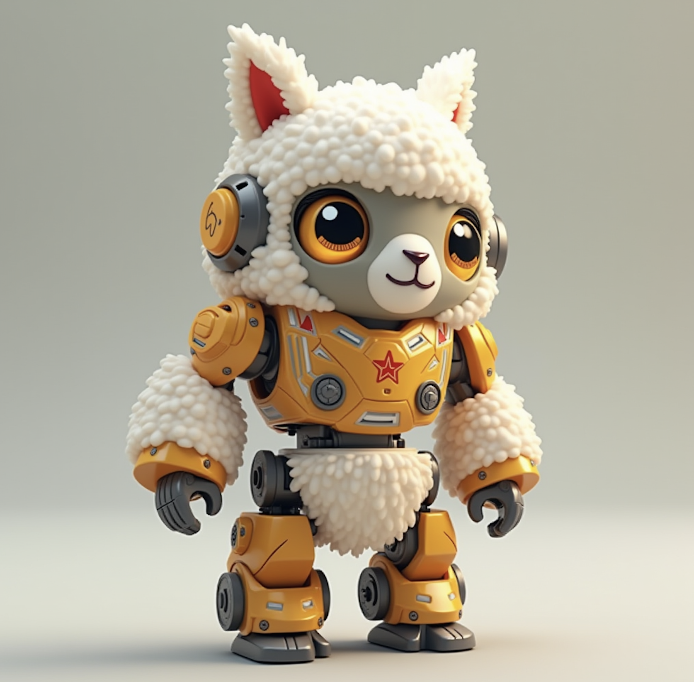

<!--
## Team Information
- Team Name: Tinytron
- Affiliation: AI Platform Dept. @ Tencent-->
# TinyTron Edge LLMs

<p align="center">
        🤗 <a href="https://huggingface.co/Tinytron">Hugging Face</a>&nbsp&nbsp | &nbsp&nbsp 📑 <a href="https://www.notion.so/Tinytron-Technical-Report-15d780ce977a8090a988fd8fd796b3c3">Technical Report</a> 
</p>
<p align="center">
    
<p>
<br><br>
Our solution focuses on delivering optimal down-stream evaluation results with constrained training data sources. We accomplish this by using a combination of pruning and knowledge distillation.

For the three compressed models in track1, we mainly use C4-en (305G version) and alpaca, as well as less than 10% of tokens generated by pruned models with degraded capability.

For track2 training from scratch, we mainly use C4-en (305G version), C4-zh and alpaca, as well as less than 2% of the formatted data generated by rules.

## Quick Start


1. For evaluation of HF models using opencompass, we kindly suggest the following [method](#evaluation-using-docker) to ensure the envrionment is well-aligned.
2. For on-device evaluation of MLC models, please follow the instructions in our [HF repository for MLC Models](https://huggingface.co/Tinytron/MLC-Tinytron).
3. For full reproduction of training codes and experiments, see the [Source-Code](./Source-Code) folder for more details. We are happy to provide instant assistantce for your need.

## Evaluation <br>

> [!IMPORTANT]
> Below are the performances of our open-source model and the current SOTA models (As of November 25, 2024) for compressing LLama on 12 public tasks. The first 6 tasks are the ones we focused on and hoped to optimize during training. MMLU and CEval are official hold-out tasks selected for evaluating performance on out-of-distribution (OOD) data. ARCc, HellaSwag, WinoGrande, and IFEval are tasks we extracted from common evaluation tasks after the competition, and they were not considered for optimization during training.

> [!NOTE]
> Please use `--hf-type chat` for evaluating the **Phi-2-Tinytron-preview** model, which is different from the uncompressed base model.
> Therefore, you can use `--hf-type chat` for all models listed below.

|Model|Total Params|Training Tokens (B)|EdgeLLM-Public(6 datasets)|EdgeLLM-Eval (8 datasets)| Extended (12 datasets)|CommonsenseQA|BBH|GSM8K      |HumanEval  |CHID       |TruthfulQA| MMLU | CEval | ARCc|HellaSwag|WinoGrande|IFEval
|-|--------------|--------------|--------------|--------------|--------------|-------------|--------------|-----------|-----------|-----------|----------|----------|----------|----------|----------|----------|----------|
|Llama3.1-8B-Instruct-Tinytron|3826965504|324|57.01 |55.41 |	58.61 |	72.40 |	63.64 |	40.24 |	63.31| 0.29 |44.47 |	58.57 |	42.67 |	80.68 |	61.92 |	57.54 |	59.91 
Qwen2-7B-Instruct-Tinytron|3861627392|	205|	55.96 |	55.05 |	57.08 |	64.37 |	74.48 |	37.80 |	58.23 |	0.28 |	44.57 |	57.70 |	46.92 	|73.90 |	67.75 |	55.56 |	47.39 
|Phi-2-Tinytron-preview|2906924544	|78	|46.48 |	45.87 |	49.24 	|47.09 |	34.87 |	49.39 |	59.44 |	0.23 |	41.84 |	54.32 |	33.74 |	74.58 |	49.79 |	57.85 |	41.69 
|Cauchy-3B-preview |3110275328	|221	|15.88 |	18.79 |	18.66 |	22.52 |	11.64 |	2.44 |	2.12 |	0.19 |	19.08 |	26.72 |	28.34 	|15.59 |	24.48| 	19.73 |	13.75 
Sparse-Llama-3.1-8B-ultrachat_200k-2of4(2:4 Semi-structured sparse, layer-wise distillation)|8030261248|	13	|53.34 |	53.44 |	57.95 |	68.22 |	47.65 |	22.56 |	67.32 |	0.28 |	57.76 |	61.21 	|46.29 |	83.73 	|79.82 |	61.56 |	42.78 
Llama-3.2-1B-Instruct(Pruning 3.1 8B base as initialization + post training)|1235814400|	9000	|38.99| 	40.07 |	43.35 |	40.29 	|33.47 |	40.85 	|47.23 |	0.23 |	25.59 |	47.11 |	39.50 |	52.88 |	38.49 	|51.38 |	56.89 
Llama-3.2-3B-Instruct(Pruning 3.1 8B base as initialization + post training)|3212749824	|9000|	56.49 |	56.09 |	59.96 |	49.63 |	50.00 |	58.54 |	77.33| 	0.27 |	49.55 	|62.21 	|47.62 |	75.25 |	64.30 |	55.88 |	75.28 

<p align="center">
    
<p>

## Evaluation using Docker
Here we provide a `opencompass.dockerfile` for preparing clean opencompass environment for the test:

```Dockerfile
FROM nvcr.io/nvidia/pytorch:24.10-py3

WORKDIR /opt

# Set the default shell to bash
SHELL ["/bin/bash", "-c"]

# Install Miniforge
RUN wget https://github.com/conda-forge/miniforge/releases/download/24.9.2-0/Miniforge3-24.9.2-0-Linux-x86_64.sh && \
    bash Miniforge3-24.9.2-0-Linux-x86_64.sh -b -p $HOME/anaconda3 && \
    rm Miniforge3-24.9.2-0-Linux-x86_64.sh && \
    echo ". $HOME/anaconda3/etc/profile.d/conda.sh" >> ~/.bashrc && \
    echo "conda activate base" >> ~/.bashrc

# Add conda to the PATH
ENV PATH="$HOME/anaconda3/bin:$PATH"

# Create the "opencompass" environment and install dependencies
RUN . $HOME/anaconda3/etc/profile.d/conda.sh && \
    conda create --name opencompass python=3.10 -y && \
    conda activate opencompass && \
    conda install pytorch torchvision torchaudio pytorch-cuda=12.1 -c pytorch -c nvidia -y && \
    pip install faiss-gpu

# Clone and set up the OpenCompass repository
RUN . $HOME/anaconda3/etc/profile.d/conda.sh && \
    conda activate opencompass && \
    git clone https://github.com/open-compass/opencompass.git && \
    cd opencompass && git checkout 0.3.1 && \
    pip install -e .

# Clone and set up the Human-Eval repository
WORKDIR /opt/opencompass
RUN . $HOME/anaconda3/etc/profile.d/conda.sh && \
    conda activate opencompass && \
    git clone https://github.com/open-compass/human-eval.git && \
    cd human-eval && pip install -e .

# Download and extract OpenCompass data
RUN wget https://github.com/open-compass/opencompass/releases/download/0.2.2.rc1/OpenCompassData-core-20240207.zip && \
    unzip OpenCompassData-core-20240207.zip && \
    rm OpenCompassData-core-20240207.zip

# Install additional Python packages
RUN . $HOME/anaconda3/etc/profile.d/conda.sh && \
    conda activate opencompass && \
    pip install importlib_metadata huggingface-hub==0.24.7

# Set the default environment to "opencompass"
CMD ["bash", "-c", "source ~/.bashrc && conda activate opencompass && exec bash"]
```

To build the Dockerfile, use the command:
```shell
docker build --network host -f "opencompass.dockerfile" -t "opencompass-0.3.1" .
```

Then you can use the built image to start an evaluation run (e.g. for the CHID dataset):
```shell
docker run -it --gpus all --name test -v /data:/data opencompass-0.3.1 bash
conda activate opencompass
CUDA_VISIBLE_DEVICES=0 opencompass \
  --datasets FewCLUE_chid_gen \
  --hf-type chat \
  --hf-path "/data/Qwen2-7B-Instruct-Tinytron" \
  --max-out-len 1024 \
  --model-kwargs device_map='auto' trust_remote_code=True \
  --debug \
  -r latest
```
